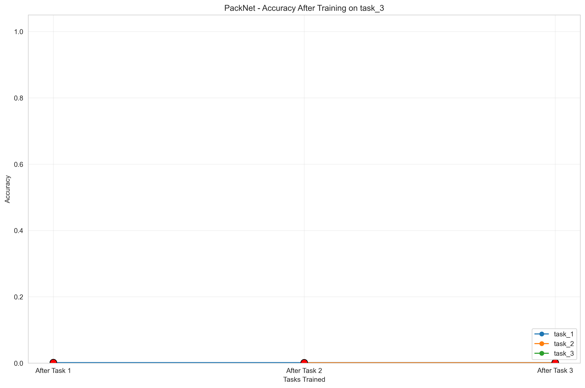

# Continual Learning for Models (CLM)

Welcome to the CLM project! 

## Getting Started

1. Check out the examples to see how to use the framework
2. Refer to specific component documentation for detailed implementation details

## What is Continual Learning?

This project is building a framework for **continual learning** - a way for AI models to learn new tasks without forgetting previous ones.

## The Problem We're Solving

Regular machine learning models have a big problem: when you train them on a new task, they tend to "forget" what they learned before (called **catastrophic forgetting**). Imagine if you learned Spanish and then started learning French, but in the process completely forgot all your Spanish!

## What We've Built So Far

1. **Replay Buffer** (Reservoir Sampling)
   - Works like a memory system that stores important examples from previous tasks
   - When learning new tasks, it occasionally reviews these old examples
   - Think of it like reviewing flashcards from previous lessons while learning new material

2. **Continual Learning Strategies**
   - **EWC** (Elastic Weight Consolidation): Identifies which parts of the model are important for old tasks and protects them from big changes
   - **LwF** (Learning without Forgetting): Uses the model's old behavior as a guide when learning new things
   - **GEM** (Gradient Episodic Memory): Makes sure learning new tasks doesn't harm performance on old tasks
   - **PNN** (Progressive Neural Networks): Creates a new network for each task while enabling knowledge transfer
   - **PackNet**: Uses network pruning to efficiently pack multiple tasks into a single network

3. **Trainer System**
   - Manages the whole training process across multiple tasks
   - Integrates the strategies and replay buffer
   - Handles saving/loading models, tracking progress, etc.

4. **Evaluation Framework**
   - Measures how well the model maintains performance on old tasks
   - Tracks metrics like "forgetting" and "knowledge transfer" between tasks
   - Creates visualizations to understand model behavior

5. **Example Usage**
   - Demonstrated how all these components work together on synthetic language tasks

## Featured Strategy: PackNet

PackNet is our latest implemented strategy that efficiently packs multiple tasks into a single network using iterative pruning. After training on each task, it:

1. Identifies and freezes important weights for the current task
2. Prunes less important weights to free up capacity
3. Uses the freed capacity for learning new tasks

### Parameter Efficiency

The visualization below shows how PackNet efficiently reuses parameters across tasks:


### Catastrophic Forgetting Prevention

PackNet successfully maintains performance on previously learned tasks:



For more details and visualizations, see the [strategies documentation](docs/strategies.md) and [screenshots](docs/screenshots/).

## In Simple Terms

We've built a system that allows AI models to learn continuously, like humans do, by using memory systems (replay buffers) and special training techniques (continual strategies) that protect important knowledge while still allowing flexibility to learn new things.

## Installation

```bash
# Clone the repository
git clone https://github.com/yourusername/clm.git
cd clm

# Install dependencies
pip install -r requirements.txt
```

## Quick Start

```python
from ml.training.continual import ContinualTrainer
from ml.continual_strategies import EWC, LwF, GEM, PackNet
import torch.nn as nn

# Initialize your model
model = nn.Sequential(...)  # Your model architecture

# Option 1: Using EWC, LwF, or GEM
trainer = ContinualTrainer(
    model=model,
    config={
        "optimizer": {"type": "adam", "lr": 0.001},
        "continual_strategy": {
            "ewc": {
                "enabled": True,
                "lambda": 100.0
            }
        }
    }
)

# Option 2: Using PackNet
trainer = ContinualTrainer(
    model=model,
    config={
        "optimizer": {"type": "adam", "lr": 0.001},
        "continual_strategy": {
            "packnet": {
                "enabled": True,
                "prune_percentage": 0.75,  # 75% of weights pruned per task
                "use_magnitude_pruning": True
            }
        }
    }
)

# Train on multiple tasks sequentially
for task_id, (train_loader, val_loader) in enumerate(task_data):
    trainer.train_task(
        train_loader=train_loader,
        val_loader=val_loader,
        task_id=task_id,
        task_name=f"task_{task_id}",
        num_epochs=10
    )
```

For a complete example, see `examples/packnet_example.py`.

## Project Structure

The codebase is organized as follows:

- `ml/replay_buffers/`: Implementation of memory systems for storing past examples
- `ml/continual_strategies/`: Implementation of continual learning algorithms
- `ml/training/`: Trainers for managing the learning process
- `ml/evaluation/`: Tools for measuring continual learning performance
- `examples/`: Example usage of the framework
- `tests/`: Unit and integration tests
- `docs/`: Detailed documentation

## Documentation

- For detailed API documentation, see `docs/api.md`
- For examples and tutorials, check the `examples/` directory
- For implementation details of strategies, see `docs/strategies.md`

## Contributing

We welcome contributions! Please follow these steps:

1. Fork the repository
2. Create a feature branch (`git checkout -b feature/amazing-feature`)
3. Make your changes
4. Run the tests (`pytest tests/`)
5. Commit your changes (`git commit -m 'Add amazing feature'`)
6. Push to your branch (`git push origin feature/amazing-feature`)
7. Open a Pull Request

## Requirements

- Python 3.8+
- PyTorch 1.8+
- NumPy
- MLflow (for experiment tracking)
- pytest (for running tests)

## License

This project is open-source and available under the MIT License. 