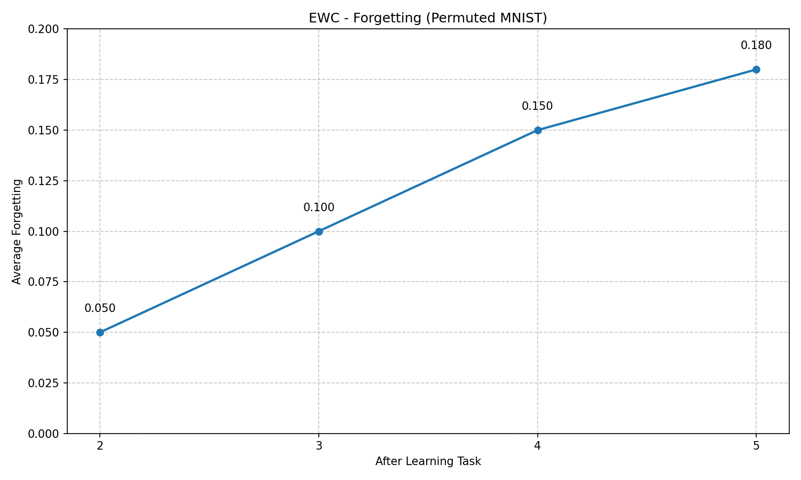

# Benchmarking Continual Learning Strategies

This document provides guidance on using the benchmarking framework to evaluate and compare different continual learning strategies in a standardized way.

## Overview

The benchmarking framework enables:

1. Systematic evaluation of continual learning strategies on standard datasets
2. Quantitative comparison of strategies based on key metrics
3. Visualization of performance across tasks
4. Fair comparison with consistent experimental settings

## Available Metrics

The benchmarking framework measures the following metrics:

- **Average Accuracy**: The mean accuracy across all tasks after training is complete
- **Average Forgetting**: The mean decrease in performance on previous tasks
- **Training Time**: Total time required to train on all tasks
- **Memory Usage**: Approximate memory consumption of the model

## Running Benchmarks

### Using the Command-Line Interface

The simplest way to run benchmarks is using the provided script:

```bash
python examples/run_benchmarks.py --dataset permuted_mnist --num-tasks 5
```

This will run all available strategies on the permuted MNIST dataset with 5 tasks.

#### Command-Line Options

```
--configs-dir CONFIG_DIR    Directory containing strategy configurations
--results-dir RESULTS_DIR   Directory to save benchmark results
--dataset {permuted_mnist,split_mnist}
                           Dataset to use for benchmarking
--num-tasks NUM_TASKS      Number of tasks (only for permuted_mnist)
--batch-size BATCH_SIZE    Batch size for training
--seed SEED                Random seed for reproducibility
--strategies STRATEGIES    List of strategies to benchmark
--no-plots                 Disable generation of plots
--load-existing            Load existing results instead of running new benchmarks
```

### Examples

Run benchmarks on a specific set of strategies:

```bash
python examples/run_benchmarks.py --strategies ewc lwf generative_replay
```

Load existing results and regenerate plots:

```bash
python examples/run_benchmarks.py --load-existing
```

Run benchmarks on split MNIST:

```bash
python examples/run_benchmarks.py --dataset split_mnist
```

### Using the API

You can also use the benchmarking framework programmatically:

```python
from ml.evaluation.benchmarks import ContinualLearningBenchmark

# Create benchmark
benchmark = ContinualLearningBenchmark(
    results_dir="results/my_benchmarks",
    configs_dir="configs/continual_learning"
)

# Run benchmarks for all strategies
results = benchmark.run_all_strategies(
    dataset="permuted_mnist",
    num_tasks=5,
    strategies=["ewc", "lwf", "er_plus"],
    batch_size=64,
    seed=42
)

# Compare strategies
comparison = benchmark.compare_strategies(
    results=results,
    metrics=["avg_accuracy", "avg_forgetting", "training_time"],
    sort_by="avg_accuracy"
)

# Create plots
benchmark.plot_comparison(
    results=results,
    metric="avg_accuracy",
    save_path="results/my_benchmarks/accuracy.png"
)
```

## Understanding Benchmark Results

### Task Accuracy Matrix

The task accuracy matrix visualizes the performance on each task after training on each task:


- **Rows**: Individual tasks (Task 1, Task 2, etc.)
- **Columns**: Performance after learning each task
- **Diagonal**: Performance on each task immediately after learning it
- **Below Diagonal**: Not applicable (tasks not yet learned)
- **Above Diagonal**: Performance on previous tasks after learning new tasks

### Forgetting Curve

The forgetting curve shows the average amount of performance lost on previous tasks as new tasks are learned:



- **X-axis**: Tasks learned
- **Y-axis**: Average forgetting
- Forgetting is calculated as the difference between the best performance on a task and the current performance

### Comparison Plots

Comparison plots allow you to easily compare strategies across specific metrics:


- These plots show the relative performance of each strategy for a given metric
- Strategies are typically sorted by performance on the selected metric

## Interpreting Results

When interpreting benchmark results, consider the following:

1. **Trade-offs**: Strategies often trade off between accuracy, forgetting, and computational/memory requirements
2. **Dataset Sensitivity**: Performance can vary significantly across datasets
3. **Task Similarity**: Forgetting tends to be more severe when tasks are dissimilar
4. **Scalability**: Consider how performance scales with the number of tasks
5. **Metric Importance**: Prioritize metrics based on your specific use case (e.g., memory constraints vs. accuracy)

## Adding New Strategies

To benchmark a new strategy:

1. Implement the strategy in the `ml/continual_strategies` directory
2. Create a configuration file in `configs/continual_learning/{strategy_name}_config.yaml`
3. Run the benchmark with `--strategies {strategy_name}`

## Best Practices

- **Reproducibility**: Always set a fixed random seed for reproducible results
- **Fair Comparison**: Use identical model architectures, optimizers, and learning rates across strategies
- **Multiple Runs**: Consider averaging results across multiple runs with different seeds
- **Statistical Significance**: Calculate confidence intervals or p-values when possible
- **Complete Reporting**: Report all relevant metrics, not just the ones where a strategy excels 