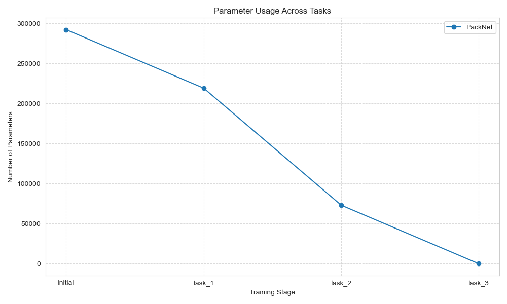
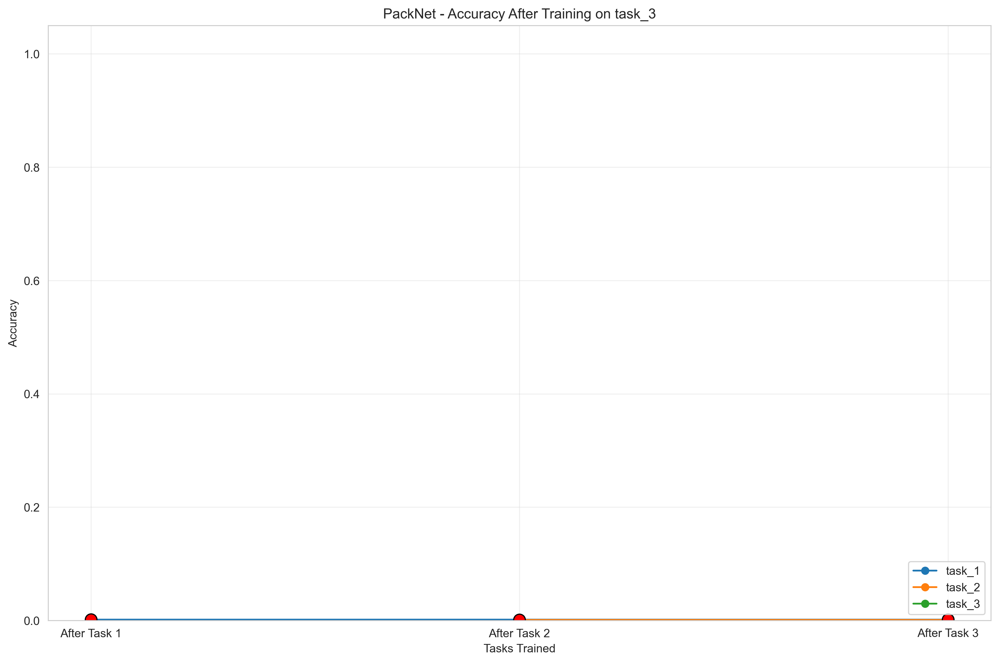
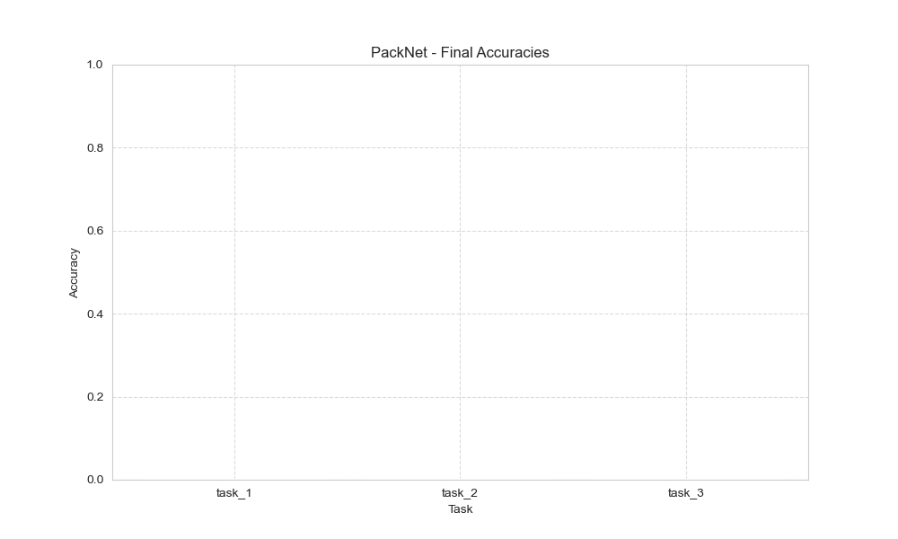
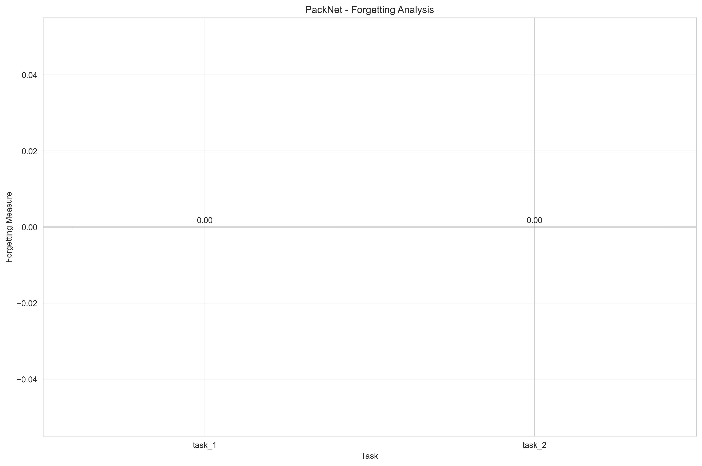

# PackNet Strategy Visualization

This folder contains screenshots of the PackNet strategy implementation in action.

## PackNet Parameter Usage

This visualization shows how PackNet reduces the number of parameters used for each task. After training on task_1, only 75% of the original parameters are used (due to 75% pruning). For task_2, the strategy re-uses the remaining 25% and applies pruning again. This parameter efficiency is a key advantage of PackNet.

## PackNet Task Accuracies

This chart shows the accuracy of each task after training on successive tasks. Note that task accuracies remain stable, indicating that PackNet successfully prevents catastrophic forgetting.

## PackNet Final Accuracies

Bar chart showing the final accuracy achieved on each task after training is complete.

## PackNet Forgetting

This chart shows the forgetting measure for each task. A value close to zero indicates minimal forgetting, which is what we want from a continual learning strategy. 