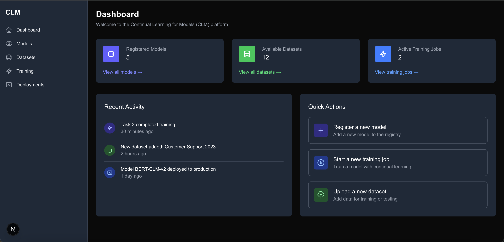

# Continual Learning for Models (CLM) Platform

A comprehensive platform for managing and training models using continual learning techniques. This platform allows you to register models, manage datasets, and run training jobs with various continual learning strategies.

## Features

- **Model Management**: Register and manage machine learning models
- **Dataset Management**: Upload and organize datasets for training
- **Training Jobs**: Run continual learning training jobs with different strategies
- **Progress Tracking**: Monitor training progress and performance metrics

## Screenshots

### Dashboard


*The dashboard provides an overview of registered models, available datasets, active training jobs, and recent activity.*

### Models Page


*The models page allows users to browse and manage registered models, including details about architecture, parameters, and training history.*

### Datasets Page


*The datasets page displays available datasets for training, with options to filter by type, size, and other attributes.*

### Training Page


*The training page shows all training jobs with their status, progress, and performance metrics. Users can start new jobs, stop running ones, or view detailed results.*

## Getting Started

First, run the development server:

```bash
npm run dev
# or
yarn dev
# or
pnpm dev
# or
bun dev
```

Open [http://localhost:3000](http://localhost:3000) with your browser to see the result.

## Continual Learning Strategies

The platform supports various continual learning strategies:

- **EWC (Elastic Weight Consolidation)**: Prevents catastrophic forgetting by constraining important parameters
- **LwF (Learning without Forgetting)**: Uses knowledge distillation to retain performance on older tasks
- **GEM (Gradient Episodic Memory)**: Uses episodic memory to constrain optimization
- **PackNet**: Uses network pruning to allocate subnetworks for new tasks
- **ER+ (Enhanced Replay)**: Augmented replay of previous examples
- **Generative Replay**: Uses generative models to produce samples from previous distributions

## Tech Stack

- **Frontend**: Next.js, React, TypeScript, TailwindCSS
- **Backend**: Next.js API routes
- **Database**: Planned integration with Convex or Drizzle ORM

## Directory Structure

The project follows a standard Next.js App Router structure:

```
/app                    # Next.js App Router
  /components           # Shared components
  /models               # Models page
  /datasets             # Datasets page 
  /training             # Training jobs page
  layout.tsx            # Root layout with navigation
  page.tsx              # Dashboard page
```

## Future Development

- User authentication and permissions
- Advanced filtering and search capabilities
- Data visualization for model performance
- Integration with popular ML frameworks
- Distributed training support

## Learn More

To learn more about Next.js, take a look at the following resources:

- [Next.js Documentation](https://nextjs.org/docs) - learn about Next.js features and API.
- [Learn Next.js](https://nextjs.org/learn) - an interactive Next.js tutorial.

You can check out [the Next.js GitHub repository](https://github.com/vercel/next.js) - your feedback and contributions are welcome!

## Deploy on Vercel

The easiest way to deploy your Next.js app is to use the [Vercel Platform](https://vercel.com/new?utm_medium=default-template&filter=next.js&utm_source=create-next-app&utm_campaign=create-next-app-readme) from the creators of Next.js.

Check out our [Next.js deployment documentation](https://nextjs.org/docs/app/building-your-application/deploying) for more details.
